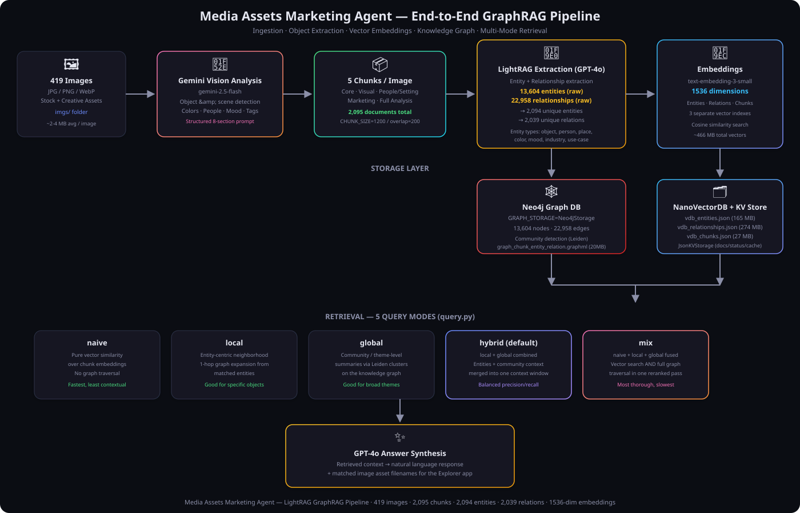
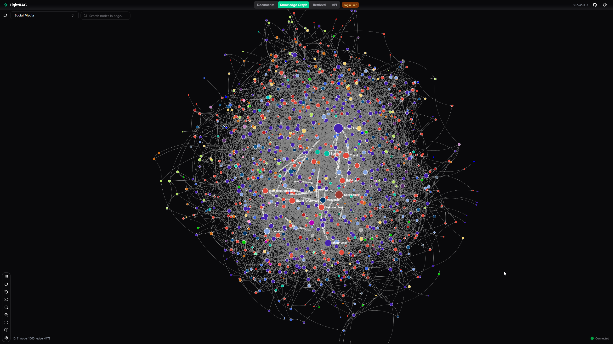
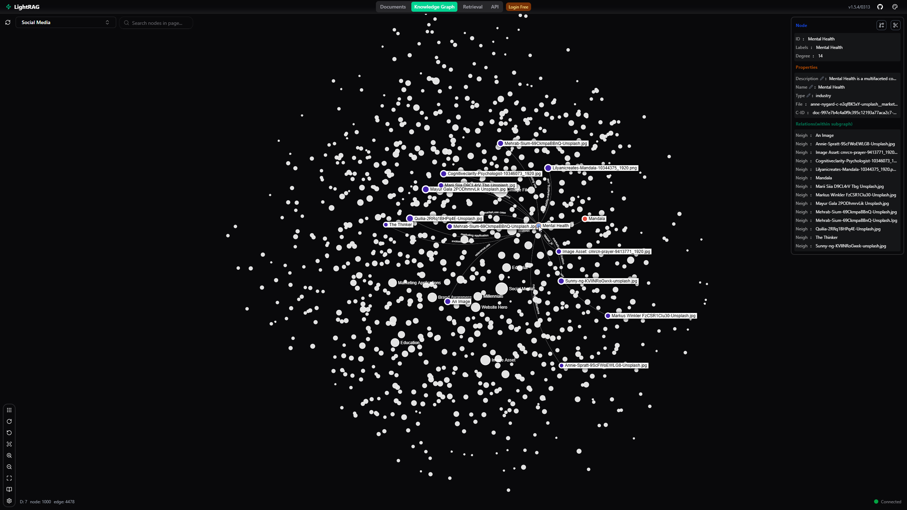
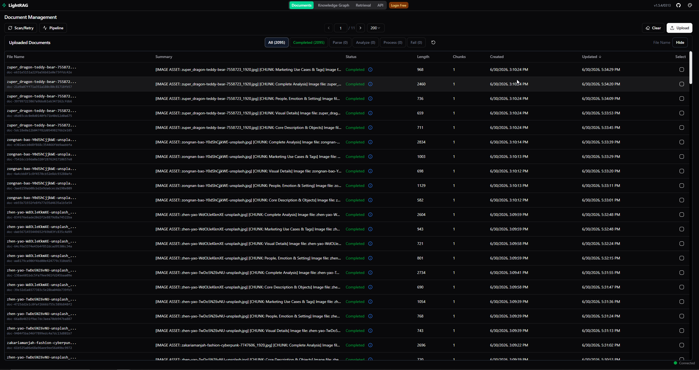

# 🖼️ Media Assets Marketing Agent

**AI-Powered Image Asset Library with Knowledge Graph Search**

Analyze 420 marketing images with **Gemini Vision** → build a rich knowledge graph with **LightRAG** → query your asset library by objects, colors, emotions, settings, mood, and marketing use-cases.

> A [LightRAG](https://github.com/HKUDS/LightRAG) demo — GraphRAG for visual media assets.

<p align="center">
  <a href="https://huggingface.co/datasets/0xrphl/Light-RAG-Marketing-Assets-Agent">
    
    <strong>Pre-ingested dataset on HuggingFace</strong>
  </a>
  &nbsp;·&nbsp;
  <a href="https://huggingface.co/datasets/0xrphl/Light-RAG-Marketing-Assets-Agent">
    
  </a>
</p>

---

## 🏗️ Architecture

<p align="center">
  
</p>

---

## 📊 Dataset Statistics

| Metric | Value |
|--------|-------|
| **Source images** | 420 (JPG / PNG / WebP) |
| **Text chunks** | 2,095 (5 per image) |
| **Graph nodes** | 13,604 entities |
| **Graph edges** | 22,958 relationships |
| **Unique entities** | 2,094 (deduplicated) |
| **Unique relations** | 2,039 (deduplicated) |
| **Embedding model** | `text-embedding-3-small` (OpenAI) |
| **Embedding dimensions** | **1,536** |
| **Total vectors** | 38,657 |
| **Pre-ingested data** | ~513 MB ([🤗 HuggingFace](https://huggingface.co/datasets/0xrphl/Light-RAG-Marketing-Assets-Agent)) |

---

## 📸 Screenshots

<table>
  <tr>
    <td align="center"><strong>Knowledge Graph (Full)</strong></td>
    <td align="center"><strong>Graph Demo</strong></td>
  </tr>
  <tr>
    <td></td>
    <td></td>
  </tr>
  <tr>
    <td align="center"><strong>Query RAG Demo</strong></td>
    <td align="center"><strong>Node Detail</strong></td>
  </tr>
  <tr>
    <td></td>
    <td></td>
  </tr>
  <tr>
    <td align="center" colspan="2"><strong>Document Management</strong></td>
  </tr>
  <tr>
    <td colspan="2" align="center"></td>
  </tr>
</table>

---

## 🚀 Quick Start

### Option A: Run with pre-ingested demo data (recommended)

No ingestion needed — download the pre-built knowledge graph from [🤗 HuggingFace](https://huggingface.co/datasets/0xrphl/Light-RAG-Marketing-Assets-Agent) and start querying immediately.

```bash
# 1. Clone & configure
git clone https://github.com/0xrphl/Light-RAG-Marketing-Assets-Agent.git
cd Light-RAG-Marketing-Assets-Agent
cp .env.example .env   # add OPENAI_API_KEY (for queries)

# 2. Install dependencies
pip install -r requirements.txt

# 3. Download pre-ingested data from HuggingFace (~513 MB)
python setup.py

# 4. Start LightRAG + Neo4j
docker compose up -d

# 5. Initialize Neo4j graph from GraphML
python init_neo4j.py

# 6. Query!
python query.py "sunset beach photos"
python query.py "professional headshots" --mode mix
python query.py "images with warm golden light" --all-modes
```

### Option B: Run empty — ingest your own images

Start with a clean LightRAG instance, bring your own images, and build the knowledge graph from scratch.

```bash
# 1. Clone & configure
git clone https://github.com/0xrphl/Light-RAG-Marketing-Assets-Agent.git
cd Light-RAG-Marketing-Assets-Agent
cp .env.example .env   # add OPENAI_API_KEY + GEMINI_API_KEY

# 2. Install dependencies
pip install -r requirements.txt

# 3. Start LightRAG + Neo4j (empty graph)
docker compose up -d

# 4. Add your images to imgs/ folder, then ingest
python ingest.py --limit 10        # start with a few to test
python ingest.py --resume          # continue ingesting remaining

# 5. Query your custom library
python query.py "your search query"
```

---

## 📁 Project Structure

```
Light-RAG-Marketing-Assets-Agent/
├── ingest.py           # Image analysis + LightRAG ingestion pipeline
├── query.py            # CLI query tool (5 modes: naive/local/global/hybrid/mix)
├── setup.py            # Download pre-ingested data from HuggingFace
├── init_neo4j.py       # Import GraphML knowledge graph into Neo4j
├── docker-compose.yml  # LightRAG + Neo4j Docker stack
├── requirements.txt    # Python dependencies
├── .env.example        # Environment variable template
├── app/                # Vue.js Explorer SPA
│   ├── index.html
│   ├── app.js
│   └── style.css
├── data/               # Pre-ingested LightRAG storage (~513 MB, via setup.py)
│   └── lightrag/
│       ├── rag_storage/  # Vectors (466 MB), KV stores, GraphML (20 MB)
│       └── tiktoken/     # Tokenizer cache
├── docs/               # Screenshots, architecture SVG, generator script
│   ├── architecture.svg
│   ├── generate_architecture_svg.py
│   └── *.png
└── imgs/               # ~420 source image assets
```

---

## 🔄 Ingestion Pipeline

Each image goes through a **multi-stage pipeline** producing **5 chunks per image**:

```
420 Images ──→ Gemini Vision (2.5-flash) ──→ 5 Chunks/Image ──→ LightRAG (GPT-4o) ──→ Embeddings (1536-d)
                                                                       │                       │
                                                                       ▼                       ▼
                                                                  Neo4j Graph            NanoVectorDB
                                                              13,604 nodes            466 MB vectors
                                                              22,958 edges            3 separate indexes
```

### Chunks per Image

| # | Chunk | Content |
|---|-------|---------|
| 1 | **Core** | Subject description, objects, elements |
| 2 | **Visual** | Colors, palette, photography style, lighting |
| 3 | **People & Setting** | Demographics, emotions, location, mood |
| 4 | **Marketing** | Industries, campaigns, audience, tags |
| 5 | **Full** | Complete analysis (holistic graph connections) |

### Gemini Vision Prompt Sections

1. Core Description · 2. Objects & Elements · 3. Colors & Palette · 4. People & Demographics
5. Setting & Place · 6. Photography & Style · 7. Mood & Atmosphere · 8. Marketing Use Cases + Tags

---

## 🔍 Query Modes

| Mode | Strategy | Use Case | Speed |
|------|----------|----------|-------|
| `naive` | Pure vector similarity over chunks | Quick similarity search | ⚡ Fastest |
| `local` | Entity-centric 1-hop graph expansion | Find specific objects/people | 🔍 Precise |
| `global` | Community-level Leiden cluster summaries | Broad theme exploration | 🌐 Broad |
| `hybrid` | local + global combined **(default)** | Balanced search | ⚖️ Balanced |
| `mix` | naive + local + global fused & reranked | Maximum coverage | 🧬 Thorough |

### Query Examples

```bash
python query.py "images of people working in an office"
python query.py "warm golden hour photography" --mode local
python query.py "images suitable for healthcare campaigns" --mode global
python query.py "outdoor adventure sports" --all-modes
python query.py   # Interactive REPL mode
```

---

## 🖥️ Explorer App

The `app/` folder contains a **Vue 3 single-page application**:

- **Query Tab** — Natural language search, 5 modes, markdown results, auto image gallery
- **Graph Tab** — Force-directed graph (1000 nodes), filter by community, node detail sidebar

```bash
python -m http.server 8899
# Open http://localhost:8899/app/
```

---

## ⚙️ CLI Options

### ingest.py

```bash
python ingest.py                      # Ingest all images
python ingest.py --limit 10           # Process first 10 only
python ingest.py --resume             # Skip already-ingested images
python ingest.py --batch-size 20      # Batch size before pause
python ingest.py --dry-run            # Analyze without ingesting
python ingest.py --clear              # Clear graph before ingesting
python ingest.py --resume --limit 50  # Resume, process 50 more
```

### query.py

```bash
python query.py "your query"              # Default hybrid mode
python query.py "your query" --mode mix   # Specific mode
python query.py "your query" --all-modes  # All 5 modes compared
python query.py                           # Interactive REPL
```

### setup.py

```bash
python setup.py           # Download pre-ingested data from HuggingFace
python setup.py --force   # Re-download even if data exists
```

### init_neo4j.py

```bash
python init_neo4j.py          # Import GraphML into Neo4j (skips if already populated)
python init_neo4j.py --force  # Clear Neo4j and reimport
```

---

## 🐳 Docker Services

| Container | Image | Port | Purpose |
|-----------|-------|------|---------|
| **lightrag** | `ghcr.io/hkuds/lightrag` | 9621 | LightRAG server (GraphRAG + WebUI) |
| **neo4j** | `neo4j:5.15.0` | 7474, 7687 | Graph database (Bolt + Browser) |

```bash
docker compose up -d          # Start services
docker compose logs -f        # View logs
docker compose down           # Stop services
docker compose down -v        # Stop + remove volumes
```

---

## 🔑 Environment Variables

| Variable | Purpose | Required |
|----------|---------|----------|
| `OPENAI_API_KEY` | LightRAG entity extraction + embeddings (GPT-4o) | ✅ |
| `GEMINI_API_KEY` | Image vision analysis (Gemini Flash) | ✅ for ingestion |
| `LLM_MODEL` | LightRAG LLM model (default: `gpt-4o`) | ❌ |
| `EMBEDDING_MODEL` | Embedding model (default: `text-embedding-3-small`) | ❌ |
| `GEMINI_MODEL` | Vision model (default: `gemini-3.5-flash`) | ❌ |

---

## 🌐 Access Points

| Service | URL |
|---------|-----|
| Explorer App | http://localhost:8899/app/ |
| LightRAG WebUI | http://localhost:9621 |
| Neo4j Browser | http://localhost:7474 |

---

## 🔬 Deep Dive: `ingest.py` — How the Pipeline Works

### Gemini Vision Prompt — 8 Structured Sections

Each image is base64-encoded and sent to the **Gemini Vision API** (`gemini-3.5-flash`, temperature `0.3`, max `4096` tokens) with a detailed structured prompt that forces the model to extract information across **8 orthogonal dimensions**:

| # | Prompt Section | What It Extracts | Why It Matters for Search |
|---|---------------|------------------|--------------------------|
| 1 | **CORE DESCRIPTION** | Subject, scene, composition (2-3 sentences) | Grounds the asset's identity — what IS this image |
| 2 | **OBJECTS & ELEMENTS** | Exhaustive list of every visible item, prop, animal, clothing | Enables object-level search ("images with laptops") |
| 3 | **COLORS & PALETTE** | Primary/secondary colors, color mood, color harmony type | Style-based retrieval ("warm earth tones", "high contrast") |
| 4 | **PEOPLE & DEMOGRAPHICS** | Count, age range, gender, clothing, expressions, activities | Audience matching ("professional women", "diverse teams") |
| 5 | **SETTING & PLACE** | Indoor/outdoor, architecture, time of day, season, geography | Location-based queries ("urban rooftop", "tropical beach") |
| 6 | **PHOTOGRAPHY & STYLE** | Shot type, angle, lighting, focus, post-processing | Technical queries ("shallow DOF portraits", "aerial shots") |
| 7 | **MOOD & ATMOSPHERE** | 3-5 mood descriptors, emotional tone, energy level | Emotional search ("calm serene images", "dynamic energetic") |
| 8 | **MARKETING USE CASES + TAGS** | Industries, campaigns, audiences, themes, 30-50 tags | Direct campaign targeting ("healthcare ads for millennials") |

> **Design decision:** Low temperature (0.3) ensures consistent, factual descriptions. High token limit (4096) allows exhaustive detail — every tag and attribute becomes a potential graph entity.

### Why 5 Chunks Per Image (Not 1 or 8)

The Gemini response is split into **5 labeled chunks** before ingestion into LightRAG. This is a deliberate design choice:

| Chunk | doc_id Pattern | Sections Combined | Rationale |
|-------|---------------|-------------------|-----------|
| **Core** | `{stem}__core` | Core Description + Objects & Elements | Identity grounding — what the image IS. Objects become entity nodes linked to the image. |
| **Visual** | `{stem}__visual` | Colors & Palette + Photography & Style | Enables style/palette/technique-based graph edges. "Golden hour" links to "warm tones" links to "sunset". |
| **People & Setting** | `{stem}__people_setting` | People & Demographics + Setting & Place + Mood | Human context — demographics, location, emotion form a rich subgraph for audience targeting. |
| **Marketing** | `{stem}__marketing` | Marketing Use Cases + Tags | Direct campaign/industry/audience entities. The 30-50 tags become highly-connected hub nodes. |
| **Full** | `{stem}__full` | Complete analysis (all 8 sections) | Holistic document lets LightRAG discover **cross-section entity links** (e.g., "golden hour" ↔ "warm tones" ↔ "wellness campaign"). |

> **Why not 1 chunk?** A single mega-document dilutes entity extraction — GPT-4o's context window gets overwhelmed and misses fine-grained connections. **Why not 8?** Too many tiny chunks fragment the graph; related concepts (e.g., colors + photography) need to co-occur in the same chunk for LightRAG to extract their relationship.

> **Why include a Full chunk?** The Full chunk is the "glue" — it lets LightRAG see ALL entities together in one document, creating cross-domain edges that the focused chunks miss. Without it, "beach" (from Setting) would never directly link to "travel campaign" (from Marketing) in the graph.

### Batch Processing & Resilience

```
ingest.py pipeline:
  1. Scan imgs/ for JPG/PNG/WebP/GIF/BMP/TIFF files (sorted)
  2. For each image:
     a. Base64 encode → POST to Gemini API (with retry on timeout)
     b. Parse response: split on "## " headers → dict of 8 sections
     c. build_chunks() → 5 labeled text documents with metadata headers
     d. POST each chunk to LightRAG /documents/text endpoint
     e. 150ms delay between chunks, 500ms between images
  3. Every --batch-size images → 2s pause (rate limit protection)
  4. Progress saved to ingestion_progress.json after every image
  5. --resume flag skips already-ingested images (idempotent reruns)
```

Each chunk includes metadata headers like `[IMAGE ASSET: filename.jpg]` and `[CHUNK: Core Description & Objects]` so LightRAG can trace entities back to their source image and chunk type.

---

## 💼 Marketing Use Cases & Enterprise Potential

This project demonstrates a **production-ready pattern** for AI-powered media asset management. The architecture — **Vision AI → structured text → GraphRAG → multi-mode retrieval** — is directly applicable to enterprise-scale media operations.

### 🏢 Enterprise Media Asset Bank

| Use Case | How This Pipeline Helps |
|----------|------------------------|
| **Corporate image libraries** | Ingest thousands of brand photos, product shots, event photography. Query by mood, audience, brand attribute — not just filename. |
| **Publishing & editorial** | Photo desks find contextually relevant images for articles. Graph edges connect "healthcare" ↔ "diverse team" ↔ "office setting" ↔ "professional" for instant mood-board generation. |
| **E-commerce catalogs** | Auto-extract product attributes (colors, materials, styles, demographics) from product shots. "Show me all lifestyle images with millennial women in casual wear." |
| **Real estate / architecture** | Building photos, interior design assets searchable by style, room type, features, color palette. Graph connects "minimalist" ↔ "white walls" ↔ "natural light" ↔ "Scandinavian style". |
| **Stock photo agencies** | Replace flat tag taxonomies with a knowledge graph. Find images by semantic relationship chains, not keyword matches. |
| **Museums & archives** | Digitized collections with rich metadata extraction — period, style, subject, emotional tone — all graph-linked for scholarly exploration. |

**Scale potential:** The pipeline processes ~420 images in ~2 hours. With parallelized Gemini calls and batch LightRAG ingestion, enterprise deployments can handle **10,000+ assets** with the same architecture.

### 🎨 AI Image Generation Bank — Auto-Cataloging Generated Assets

Connect to image generation tools to **automatically catalog every generated asset** the moment it's created:

```
┌─────────────────────────────────────────────────────────────────────┐
│                    AI IMAGE GENERATION PIPELINE                     │
├─────────────────────────────────────────────────────────────────────┤
│                                                                     │
│  DALL-E 3 / Midjourney / Stable Diffusion / Flux                   │
│          │                                                          │
│          ▼                                                          │
│  Generated Image ──→ Save to Asset Library (S3 / local)            │
│          │                                                          │
│          ▼                                                          │
│  Gemini Vision Analysis (8-section structured prompt)               │
│          │                                                          │
│          ▼                                                          │
│  5 Chunks ──→ LightRAG ──→ Knowledge Graph + Vector DB             │
│                                    │                                │
│                                    ▼                                │
│  ┌──────────────────────────────────────────────────┐               │
│  │ Searchable by: style, mood, subject, colors,     │               │
│  │ industry fit, campaign type, target audience,     │               │
│  │ similar existing assets (graph neighborhood)      │               │
│  └──────────────────────────────────────────────────┘               │
└─────────────────────────────────────────────────────────────────────┘
```

**Key capabilities:**
- **Auto-tag generated images** as they're created — no manual tagging labor
- **Deduplicate visually** — graph relationships surface near-identical generated assets before they clutter the library
- **Cross-reference generated vs. stock** — find which stock photos match the style of your AI-generated hero images (and vice versa)
- **Prompt-to-asset traceability** — store generation prompts alongside Gemini analysis to build a prompt → visual outcome knowledge base
- **Brand consistency scoring** — query the graph: "How similar is this generated image to our existing brand assets in terms of color palette, mood, and style?"

### ⚡ n8n / Make / Zapier — Automation Workflow Recipes

Integrate with **n8n**, **Make**, or **Zapier** for fully automated marketing pipelines. The LightRAG REST API (`/documents/text`, `/query`) makes integration trivial:

| Workflow | Trigger | Pipeline | Output |
|----------|---------|----------|--------|
| **Auto-ingest on upload** | New image uploaded to S3/GDrive/Dropbox | → Gemini Vision → 5 chunks → LightRAG POST | Asset auto-cataloged in knowledge graph |
| **Campaign asset finder** | Marketing brief form submitted | → Extract keywords → Query LightRAG (hybrid mode) | Ranked image suggestions with explanations |
| **Social media scheduler** | Content calendar event | → Query by mood/theme/audience → Select best asset → Post to Buffer/Hootsuite | Auto-selected on-brand image published |
| **Brand compliance check** | New asset uploaded by external agency | → Gemini analysis → Compare against brand entity cluster in graph | Pass/fail report with visual attribute diff |
| **Seasonal content surfacing** | Cron trigger (weekly/monthly) | → Query "spring outdoor wellness" or "winter holiday festive" | Pre-curated seasonal asset collections |
| **DAM ↔ Knowledge Graph sync** | Asset updated/deleted in DAM (Bynder, Brandfolder) | → Webhook → Re-analyze or remove from LightRAG graph | Graph always reflects current DAM state |
| **Client mood board generator** | Client brief uploaded (PDF/doc) | → Extract themes with LLM → Query LightRAG per theme → Compile grid | Auto-generated mood board PDF/Figma frame |
| **Competitor visual analysis** | Scrape competitor social feeds | → Download images → Gemini analysis → Ingest into separate graph | "What visual themes does competitor X use that we don't?" |

**Example n8n flow:**

```
┌────────────┐     ┌────────────┐     ┌──────────────────┐     ┌─────────────┐
│  Google     │     │  Gemini    │     │  LightRAG        │     │  Slack      │
│  Drive      │────▶│  Vision    │────▶│  /documents/text │────▶│  Notify     │
│  (trigger)  │     │  API       │     │  (POST 5 chunks) │     │  #assets    │
└────────────┘     └────────────┘     └──────────────────┘     └─────────────┘
  "New file in       "Analyze &          "Ingest into          "✅ beach-sunset.jpg
   /brand-assets"     extract 8           knowledge graph"      ingested: 32 entities
                      sections"                                  extracted, linked to
                                                                 'travel', 'wellness',
                                                                 'golden-hour'"
```

### 📢 Campaign & Publishing Workflows

The knowledge graph transforms how creative teams discover and deploy visual assets:

```
┌─────────────────────────────────────────────────────────────────────────────┐
│                        CAMPAIGN ASSET WORKFLOW                              │
├─────────────────────────────────────────────────────────────────────────────┤
│                                                                             │
│  1. BRIEF           2. GRAPH QUERY           3. CURATION        4. DEPLOY  │
│  ┌──────────┐       ┌──────────────┐         ┌──────────┐      ┌────────┐  │
│  │ "Summer  │       │ hybrid mode: │         │ 15 images│      │ Social │  │
│  │  wellness│──────▶│ "outdoor,    │────────▶│ ranked   │─────▶│ Web    │  │
│  │  campaign│       │  warm light, │         │ by graph │      │ Print  │  │
│  │  for     │       │  active,     │         │ relevance│      │ Email  │  │
│  │  Gen Z"  │       │  nature,     │         │ + human  │      │ Ads    │  │
│  └──────────┘       │  wellness"   │         │ review   │      └────────┘  │
│                     └──────────────┘         └──────────┘                   │
│                                                                             │
│  WHY GRAPH BEATS TAGS:                                                      │
│  • Tag search: "wellness" → 50 results (many irrelevant)                   │
│  • Graph search: "wellness" + 1-hop → connected to "outdoor", "active",    │
│    "warm light", "millennial", "yoga" → 12 precise results                 │
│  • Mix mode: vector similarity + graph traversal → 8 perfect matches       │
└─────────────────────────────────────────────────────────────────────────────┘
```

**Use cases by industry:**

| Industry | Workflow | Graph Advantage |
|----------|----------|-----------------|
| **Advertising agencies** | Rapid asset discovery for client pitches, mood boards, campaign decks | Graph neighborhood reveals unexpected visual connections — "this office shot also links to 'innovation' and 'diversity'" |
| **Social media teams** | Find on-brand images by emotion + color palette + target demographic | Entity-linked taxonomy ensures visual consistency across Instagram, LinkedIn, TikTok |
| **Content marketing** | Match blog topics to relevant imagery using semantic + graph search | "Find images that connect to both 'technology' AND 'human warmth'" — impossible with flat tags |
| **Brand management** | Audit visual consistency across 10,000+ assets across channels | Community detection (Leiden clusters) reveals natural visual themes in your library |
| **News & media** | Photo desk finds contextually relevant images for breaking stories in seconds | Graph edges connect "protest" ↔ "urban" ↔ "crowd" ↔ "signs" — not just keyword "protest" |
| **Education / e-learning** | Organize educational media by subject, mood, accessibility needs | "Find calming science images suitable for anxious learners" — mood + subject + audience graph query |
| **Pharmaceutical / healthcare** | Compliant image selection for regulated marketing materials | Graph can encode compliance attributes as entities — "approved for EU markets" as a node |
| **Travel & hospitality** | Destination marketing with mood-matched seasonal imagery | "Summer Mediterranean luxury" traverses mood → setting → season → style graph paths |

### 🏗️ Enterprise Architecture — Where This Fits

```
┌─────────────────────────────────────────────────────────────────────┐
│                     ENTERPRISE MEDIA ECOSYSTEM                      │
├─────────────────────────────────────────────────────────────────────┤
│                                                                     │
│  ┌─────────────┐    ┌──────────────┐    ┌─────────────────────┐    │
│  │ DAM System  │    │ AI Gen Tools │    │ Stock Photo APIs    │    │
│  │ (Bynder,    │    │ (DALL-E,     │    │ (Getty, Shutterstock│    │
│  │ Brandfolder,│    │ Midjourney,  │    │ Unsplash, Pexels)   │    │
│  │ Adobe AEM)  │    │ Flux, SD)    │    │                     │    │
│  └──────┬──────┘    └──────┬───────┘    └──────────┬──────────┘    │
│         │                  │                       │               │
│         ▼                  ▼                       ▼               │
│  ┌─────────────────────────────────────────────────────────┐       │
│  │            ingest.py — Vision AI Pipeline                │       │
│  │  Gemini Vision → 8-section analysis → 5 chunks/image   │       │
│  └────────────────────────┬────────────────────────────────┘       │
│                           │                                        │
│                           ▼                                        │
│  ┌─────────────────────────────────────────────────────────┐       │
│  │         LightRAG — Knowledge Graph + Vector DB          │       │
│  │  13K+ entities · 23K+ relationships · 1536-d embeddings │       │
│  └────────────────────────┬────────────────────────────────┘       │
│                           │                                        │
│         ┌─────────────────┼─────────────────┐                      │
│         ▼                 ▼                  ▼                      │
│  ┌────────────┐   ┌─────────────┐   ┌──────────────┐              │
│  │ n8n / Make │   │ Explorer    │   │ REST API     │              │
│  │ Workflows  │   │ Web App     │   │ Integration  │              │
│  │ (automated │   │ (query +    │   │ (CMS, social │              │
│  │ campaigns) │   │ graph viz)  │   │ schedulers)  │              │
│  └────────────┘   └─────────────┘   └──────────────┘              │
│                                                                     │
└─────────────────────────────────────────────────────────────────────┘
```

### 🔮 Future Directions

- **Multi-modal embeddings** — CLIP/SigLIP for direct image-to-image similarity alongside text-based graph
- **Video frame extraction** — Extend pipeline to video assets (keyframe analysis + temporal graph)
- **Brand style guides as graph nodes** — Encode brand colors, fonts, tone-of-voice as entities for compliance queries
- **Collaborative tagging** — Human-in-the-loop refinement of auto-extracted entities via the Explorer app
- **API gateway** — REST API for external DAM/CMS integration (Bynder, Brandfolder, Adobe AEM)
- **Real-time ingestion** — WebSocket-based pipeline for live event photography (conference photo → graph in < 30s)
- **Multi-tenant graph** — Isolated subgraphs per client/brand with shared entity vocabulary
- **Cost optimization** — Gemini Flash for analysis (~$0.002/image), GPT-4o-mini for entity extraction, local embeddings for air-gapped deployments

---

## � License

MIT License
